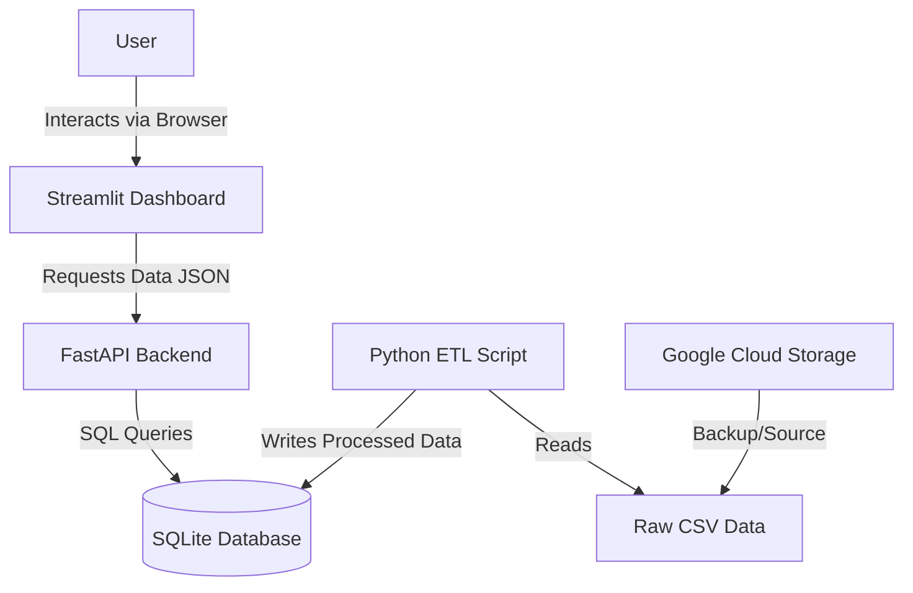
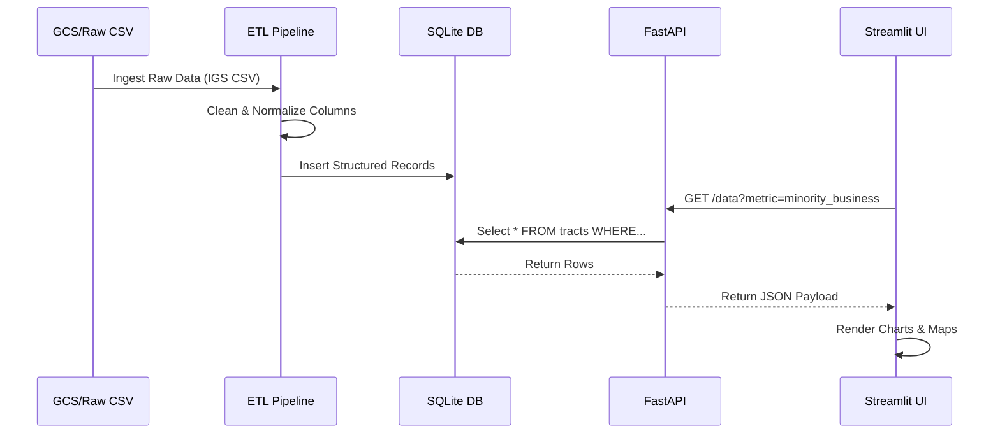

# Capstone Proposal: Equity in Focus

## Visualizing Economic Inclusion with the Mastercard Inclusive Growth Score

---

## 1. Project Purpose, Goals, and Social Impact

Economic growth is often measured by GDP, but aggregate numbers frequently hide deep disparities within communities. The goal of this project is to bridge that information gap by analyzing the **Mastercard Inclusive Growth Score (IGS)**. We aim to build a full-stack data application that allows policymakers, non-profits, and community leaders to visualize where economic opportunities are flourishing and where they are stalling.

Our primary objective is to **analyze equity and opportunity across U.S. communities**. By correlating key indicators—specifically Minority/Women-Owned Business presence, Internet Access, and Affordable Housing—we will identify patterns of exclusion. The social impact of this tool lies in its ability to highlight **"investment deserts"** and support data-driven decision-making for DEI (Diversity, Equity, and Inclusion) initiatives.

---

## 2. Dataset Justification

We have selected the **Mastercard Inclusive Growth Score dataset** for its unique focus on inclusion rather than just output. Unlike standard Census data, which provides static demographics, the IGS combines proprietary transaction insights with open-source data to score census tracts against state averages.

### Key Variables for Analysis

- **Minority/Women-Owned Businesses Score:** A critical metric for assessing economic equity and entrepreneurship in marginalized groups.
- **Internet Access Score:** A proxy for digital inclusion, essential for education and remote work.
- **Affordable Housing & Personal Income:** Fundamental baselines for community stability.

This dataset is ideal for our DEI theme because it **normalizes complex economic factors into comparable scores (1-100)**, allowing for immediate "apples-to-apples" comparisons between different counties and urban/rural contexts.

---

## 3. Technical Architecture

We will implement a **decoupled architecture** to ensure scalability and clear separation of concerns:

- **Frontend:** Streamlit. Chosen for its ability to rapidly deploy interactive data visualizations (choropleth maps, scatter plots) without heavy frontend boilerplate.
- **Backend:** FastAPI. This high-performance framework will serve data to the frontend via RESTful endpoints, allowing for potential future expansion (e.g., mobile apps).
- **Database:** SQLite (Development) & Google Cloud Storage (Data Lake). Raw CSVs will be stored in GCS for durability, then ingested into a structured SQLite database for fast querying by the API.
- **DevOps:** GitHub Actions will be used for CI/CD pipelines to lint code and run basic tests on push.

### System Architecture Diagram

### Data Flow Diagram

---

## 4. Dashboard Design and Visualizations

The Streamlit dashboard will feature three main views:

### The Equity Map
An interactive choropleth map showing the **"Inclusive Growth Score"** by Census Tract, allowing users to filter by State or County.

### The Opportunity Gap Analysis
A comparative view where users select a specific tract and compare its Internet Access and Minority Business scores against the state average.

### Correlation Explorer
Scatter plots analyzing relationships, such as:
- "Does higher Internet Access correlate with higher Small Business Loan scores in this region?"

---

## 5. Data Management Lifecycle

1. **Ingestion:** Raw CSV data (Mastercard IGS) is uploaded to a Google Cloud Storage bucket.
2. **Processing:** A Python ETL script cleans the data (handling nulls in Growth or Inclusion columns) and normalizes column names.
3. **Storage:** Processed data is loaded into a SQLite database file.
4. **Access:** FastAPI queries the SQLite database based on frontend parameters (e.g., `GET /tracts?state=TX`).
5. **Presentation:** Streamlit consumes the JSON response and renders charts.

---

## 6. Ethical Considerations

### Representation Bias
While the dataset is robust, spending data is often skewed toward those with bank accounts/credit cards. We must acknowledge that **cash-based economies** (often in lower-income areas) may be underrepresented.

### Privacy & Stigmatization
Although data is aggregated to the Census Tract level to protect individual privacy, visualizing "low scores" can inadvertently stigmatize specific neighborhoods. We will frame visualizations around **"opportunity potential"** rather than "deficits."

---

## 7. Developer Responsibilities

**Solo Developer (Emery)** - Full-stack responsibilities:

### Backend Development
- FastAPI implementation
- Database schema design (SQLite)
- Data cleaning pipelines
- Google Cloud Storage integration

### Frontend Development
- Streamlit dashboard design
- Data visualization logic (charts/maps)
- User experience flow

### Shared Responsibilities
- Architecture planning
- GitHub repository management
- Documentation
- Testing and deployment

---

## Appendix: Clear, Measurable Project Objectives

1. ✅ **Objective 1:** Develop a REST API with at least 5 endpoints for querying IGS data by geography and metrics
2. ✅ **Objective 2:** Create an interactive Streamlit dashboard with at least 3 distinct visualization types (choropleth map, scatter plot, bar chart)
3. ✅ **Objective 3:** Implement a complete ETL pipeline that cleans and normalizes the IGS dataset, handling missing values and standardizing column names
4. ✅ **Objective 4:** Deploy the application with proper data management (SQLite for queries, GCS for raw data storage)
5. ✅ **Objective 5:** Document all ethical considerations and bias mitigation strategies in project documentation

---

**Prepared by:** Emery  
**Course:** CIS 301 - Capstone Project  
**Institution:** AUC Data Science Institute  
**Date:** November 19, 2025

